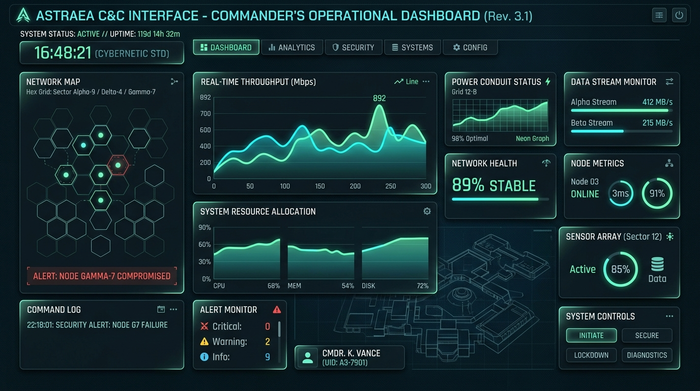
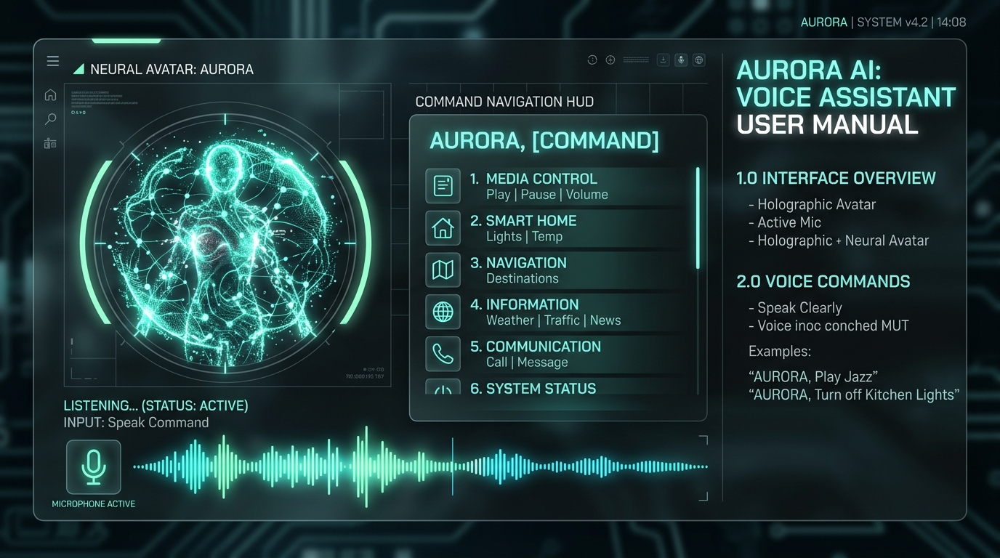
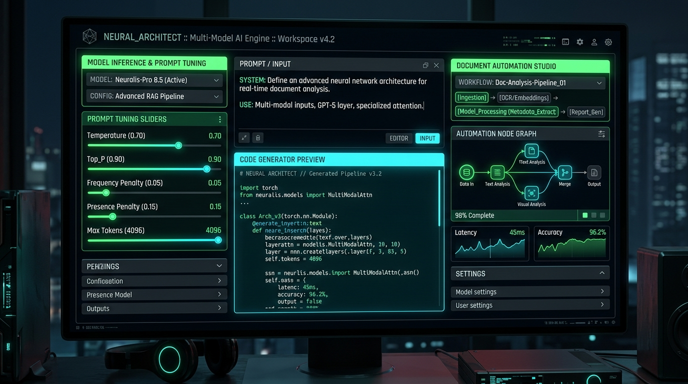
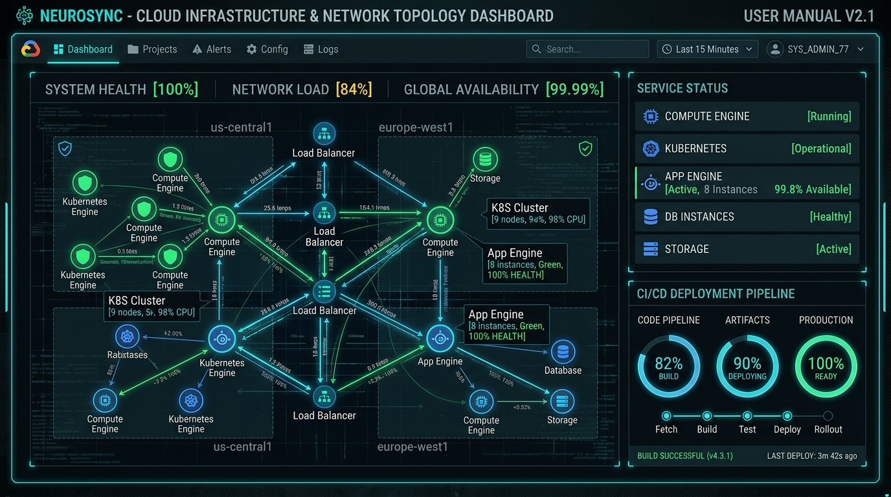

# Oistarian-NEXUS-ONE: Enterprise Command Ecosystem
> A hyper-advanced, AI-powered command center and autonomous operational ecosystem fusing real-time multi-model intelligence, microphone-driven voice navigation, cloud service orchestration, and automated business workflows.

---

## System Overview

**Oistarian-NEXUS-ONE** serves as a unified mission control platform engineered for developers, enterprise operators, and creators. It brings together multi-model AI synthesis, cloud infrastructure governance (Google App Engine, Cloud SQL, Vertex AI), real-time microservice topology maps, and hands-free voice command execution into a responsive, high-contrast cybernetic interface.

```
+-------------------------------------------------------------------------------+
|                             OISTARIAN-NEXUS-ONE                               |
|                            Global Mission Control                             |
+-------------------------------------------------------------------------------+
        |                       |                       |               |
        v                       v                       v               v
+---------------+       +---------------+       +---------------+ +-------------+
| Real-time HUD |       | Neural Voice  |       | Multi-Model   | | Cloud & GAE |
| Telemetry &   | <---> | Activation &  | <---> | AI Engine &   | | Topology    |
| Command Radar |       | Avatar Sync   |       | Architect     | | Services    |
+---------------+       +---------------+       +---------------+ +-------------+
```

---

## User Manual & Interface Walkthrough

### 1. Command Center & Telemetry Dashboard
The **Command Center** provides an immediate high-altitude operational summary of all active sub-systems, including live cluster health, throughput radars, priority alerts, and real-time execution pulses.



#### Key Operational Capabilities:
- **Throughput & Latency Gauges**: Instant visual telemetry across all backend relays and microservice nodes.
- **Unified Health Radars**: Continuous scanning of network integrity, active API tokens, and compute loads.
- **Quick-Switch Launchpad**: Rapid access bar for jumping straight to high-priority business operations.

---

### 2. Avatar Sync & Voice Activation Listener
The **Avatar Sync & Voice Listener** enables hands-free vocal navigation and real-time neural persona modulation. It leverages the Web Speech Recognition API alongside customizable vocal synthesis feedback.



#### How to Use Voice Activation:
1. **Activate Microphone**: Click the large glowing microphone button in the voice HUD or trigger via keyboard shortcut.
2. **Speak Navigation Command**: Clearly say phrases such as *"Open AI Engine"*, *"Go to Topology Map"*, or *"Launch Smart Inbox"*.
3. **Real-Time Visualizer**: Observe live soundwave equalizer spectrum feedback as your speech is transcribed and parsed.
4. **Vocal Confirmation**: The system will audibly confirm the action and immediately switch to the target workspace.
5. **Persona Selection**: Switch between **Aura** (*Strategic & Calm*), **Nova** (*Dynamic & Precise*), and **Echo** (*Adaptive & Geometric*).

---

### 3. Unified AI Engine & Neural Architect Studio
The **AI Engine** and **Neural Architect** provide an integrated environment for prompt experimentation, autonomous code scaffolding, document generation, and predictive business intelligence.



#### Core Capabilities:
- **Model Orchestration**: Multi-model inference testing across Gemini Flash, Pro, and custom neural agents.
- **Automated Scaffolding**: Generate full-stack architectural blueprints and instant app prototypes.
- **Prompt Parameter Lab**: Precision sliders for temperature, top-k sampling, frequency penalty, and context retention.

---

### 4. Cloud Parameters, App Engine & Topology Map
The **Cloud Configuration Hub** and **Topology Map** offer deep visibility into Google Cloud Platform services, App Engine deployment parameters, and dependency graphs.



#### Infrastructure Controls:
- **Google Cloud Services Manager**: Enable or disable the App Engine Admin API (`appengine.googleapis.com`), Cloud Source Repositories (`sourcerepo.googleapis.com`), and Cloud SQL Admin API with single-click orchestration.
- **Terraform & Parameter Vaults**: Review infrastructure as code configurations and secure API key registries.
- **Interactive Service Topology**: Visual node cluster graphing showing live inter-service connectivity and response times.

---

## Voice Navigation Command Reference

| Spoken Trigger Phrase | Target Module | System Action |
| :--- | :--- | :--- |
| `"Go to dashboard"` / `"Open command center"` | **Command Center** | Opens primary system metrics and telemetry overview |
| `"Open AI engine"` / `"Switch to neural models"` | **AI Engine** | Launches multi-model prompt and inference matrix |
| `"Open cloud parameters"` / `"Show App Engine"` | **Cloud Parameters** | Displays Google Cloud APIs and infrastructure configs |
| `"Open topology map"` / `"Show dependency graph"` | **Topology Map** | Renders interactive microservices cluster visualizer |
| `"Go to smart inbox"` / `"Check priority notifications"`| **Smart Inbox** | Opens AI-categorized communications and alerts |
| `"Open deployment hub"` / `"Show CI CD pipeline"` | **Deployment Hub** | Manages releases, container metrics, and rollbacks |
| `"Open smart docs"` / `"Generate contract"` | **Smart Docs & Forms**| Accesses legal templates, NDAs, and automated invoices |
| `"Open marketing suite"` / `"Show SEO campaigns"` | **Marketing Suite** | Opens autonomous marketing and growth analytics |
| `"Open social control"` / `"Go to feeds"` | **Social Control** | Unified multi-channel social media dispatch |
| `"Open navigation system"` / `"Show GPS map"` | **Navigation System** | Global GPS waypoint routing and telemetry paths |
| `"Open AR interface"` / `"Switch to AR view"` | **AR Interface** | Launches spatial augmented reality holographic HUD |
| `"Set avatar to Nova"` / `"Change persona to Echo"` | **Avatar Sync** | Hot-swaps the active neural voice persona |
| `"Help"` / `"What can I say?"` | **Voice Modal** | Pops up the complete searchable Voice Reference Index |

---

## Module Index

1. **Command Center (`CustomDashboard`)**: Live metrics, event logs, and status dashboards.
2. **Unified AI Engine (`AIEngine`)**: Prompt studio, generative inference, and model metrics.
3. **Avatar Sync & Voice (`AIAssistant`)**: Microphone listener, speech synthesis, and persona customizer.
4. **Cloud Parameters (`CloudConfig`)**: Google Cloud APIs, App Engine services, and API keys.
5. **Topology Map (`DependencyMap`)**: Interactive node-graph of connected microservices.
6. **Smart Inbox (`SmartInbox`)**: Priority-ranked notifications, client requests, and security digests.
7. **Instant Builder (`InstantBuilder`)**: Generative full-stack application prototyping.
8. **Deployment Hub (`DeploymentHub`)**: Container health, deployment logs, and rollback triggers.
9. **Smart Docs & Forms (`SmartDocs`)**: NDA generators, compliance contracts, and billing forms.
10. **Marketing Suite (`MarketingSuite`)**: Autonomous campaign generation, SEO auditing, and ad analytics.
11. **Social Control (`SocialControl`)**: Multi-platform post scheduling and engagement streams.
12. **Sales Intelligence (`SalesIntelligence`)**: Revenue forecasting and CRM deal velocity tracking.
13. **Navigation System (`NavigationSystem`)**: Telemetry route plotting and global waypoints.
14. **AR Interface (`ARInterface`)**: Augmented reality vision HUD and holographic overlay.
15. **Collaboration Hub (`CollaborationHub`)**: Real-time multiplayer presence and agent co-working.
16. **Content Matrix (`ContentHub`)**: Editorial queues, article publication, and multi-channel RSS.
17. **App Settings (`AppSettings`)**: System preferences, security permissions, and themes.

---

## Technical Architecture & Setup

### Requirements
- **Node.js**: `v18.0.0+`
- **Package Manager**: `npm` or `bun`
- **Supported Browsers**: Chrome, Edge, Safari, Firefox (Web Speech API works best in Chromium-based browsers)

### Development Setup
```bash
# Clone the repository
git clone https://github.com/oistars/oistarian-nexus-one.git

# Install dependencies
npm install

# Start development server on port 3000
npm run dev
```

### Production Build
```bash
# Compile client SPA and backend bundling
npm run build

# Start production server
npm start
```

### Environment Configuration (`.env`)
```env
# Server-side Gemini API credentials
GEMINI_API_KEY=your_gemini_api_key_here
```

---

*Oistarian-NEXUS-ONE // Autonomous Command Architecture // Designed for Next-Generation Operators*
